# Assistive Gym v1.0 Extension

#### Federico Pivotto - UniPD BSc Thesis
***

## Thesis experimental activity

The experimental activity completed involved studying the operation of the Assistive Gym v1.0 framework and developing an extension to it. This includes support for the TIAGo robot, its integration into pre-existing simulation environments, and the creation of a new one in which the TIAGo robot is engaged in handovering an object to the human in a static or active condition.

This extension was subsequently used as an aid in the discussion conducted in the thesis, in which the importance of human-robot collaboration was highlighted, particularly in the industrial environment, and then experimented with the TIAGo robot on the usefulness of the contribution made by the human in training control policies and its impact in achieving the successful condition in some specific tasks. At the end, the results obtained were compared with those obtained by the authors of the framework with existing robots.

Control policies were generated for the pre-existing simulation environments and the new environment for the TIAGo robot over 1,000,000 timesteps. Computational limitations did not allow them to be refined further: in the future it might be useful to resume training and achieve the same level of learning as the authors' control policies, i.e., 10,000,000 timesteps.

## Extension contributions

### Support for TIAGo robot
The mesh model of the TIAGo robot was generated using the official packages made available by PAL Robotics in [GitHub](https://github.com/pal-robotics). From these, a customized one-armed TIAGo robot equipped with the PAL Parallel Gripper was extracted.

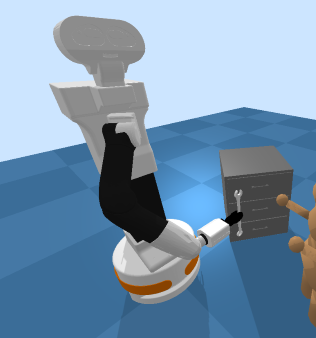

### TIAGo robot in pre-existing environments
The TIAGo robot was integrated within the pre-existing simulation environments in the framework: Itch Scratching, Bed Bathing, Drinking Water, Feeding, Dressing, and Arm Manipulation.

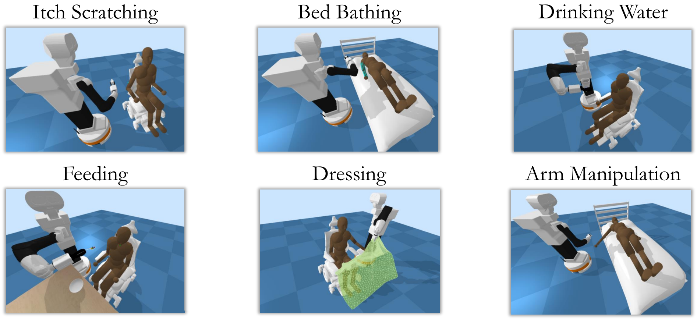

### Object Handover environment for TIAGo robot
The new simulation environment concerns the handovering of an object, specifically a [wrench](https://free3d.com/3d-model/combination-wrench-v1--661572.html), from the robot's end effector to the human's right hand and then restoring the former to its starting position. The TIAGo robot has been integrated into this environment, but simple modifications also allow the integration of robots already in the framework.

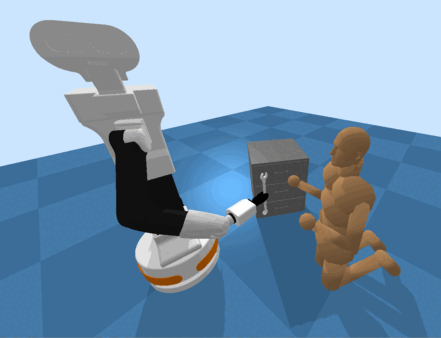

### Trained policies
For each pre-existing and new simulation environment, a control policy was generated for the TIAGo robot in both the static human case and the active human case. In total, there are 14 control policies, each learned over 1,000,000 timesteps.

The path followed during the experimental activity first led to the generation of the control policies with static human by employing the `ray[rllib]==1.12.1` module, and only later by employing the `ray[rllib]==1.3.0` module. In contrast, the control policies with active human were generated by directly adopting the `ray[rllib]==1.3.0` module due to framework malfunctions with `ray[rllib]==1.12.1` in this variant of the simulation environments.

All these control policies are made available within respective ZIP files, included within the `trained_models/ppo` directory:
```
pretrained_policies_tiago_statichuman_ray_1.12.1.zip
pretrained_policies_tiago_statichuman_ray_1.3.0.zip
pretrained_policies_tiago_activehuman_ray_1.3.0.zip
```

## Setup requirements

The installation of the framework was based on a virtual environment with Python 3.6.8 and the modules required by the Assistive Gym v1.0 setup. However, constraint and version upgrading of some modules and dependencies was necessary to succeed in the installation and full operation of the framework. Specifically, the modules subject to this change and the version fixed are:
```python
gym==0.15.7, tensorflow==2.6.2, keras==2.6.0, h5py==3.1.0, ray[rllib]==1.3.0, lz4==3.1.3
```

### Fix for TensorFlow 2.6.2

The upgrade to TensorFlow 2.6.2 required a refactor to replace a deprecated function used in the framework. In particular, the file subject to change is `assistive_gym/envs/agents/human.py/human.py` where the following line of code:
```python
result = self.limits_model.predict_classes(np.array([[tz2, tx2, ty2, qe2]]))
```
must be replaced with the code snippet:
```python
predict_class = self.limits_model.predict(np.array([[tz2, tx2, ty2, qe2]])) 
result = np.argmax(predict_class, axis=1)
```

# Assistive Gym v1.0
#### v1.0 (this branch) has been released! See the feature list below for what is new in v1.0.  
#### Assistive Gym in also now supported in Google Colab! For example: [](https://colab.research.google.com/drive/1qFbjuq5lFxPijyw4PFUiZw2sFpXTR7ok?usp=sharing)  
#### See the [Wiki](https://github.com/Healthcare-Robotics/assistive-gym/wiki/7.-Google-Colab) for all available Google Colab examples.
***

Assistive Gym is a physics-based simulation framework for physical human-robot interaction and robotic assistance.

Assistive Gym is integrated into the OpenAI Gym interface, enabling the use of existing reinforcement learning and control algorithms to teach robots how to interact with people. 

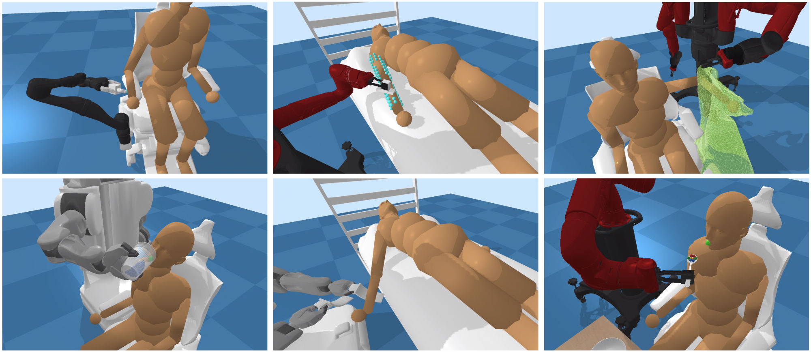

### Paper
A paper on Assistive Gym can be found at https://arxiv.org/pdf/1910.04700.pdf

Z. Erickson, V. Gangaram, A. Kapusta, C. K. Liu, and C. C. Kemp, “Assistive Gym: A Physics Simulation Framework for Assistive Robotics”, IEEE International Conference on Robotics and Automation (ICRA), 2020.
```
@article{erickson2020assistivegym,
  title={Assistive Gym: A Physics Simulation Framework for Assistive Robotics},
  author={Erickson, Zackory and Gangaram, Vamsee and Kapusta, Ariel and Liu, C. Karen and Kemp, Charles C.},
  journal={IEEE International Conference on Robotics and Automation (ICRA)},
  year={2020}
}
```

## Install
### Google Colab
[](https://colab.research.google.com/drive/1PAY5HnLKRB-TBsPaevRr6myMfpVt_yzF?usp=sharing)  
[Try out Assistive Gym in Google Colab.](https://colab.research.google.com/drive/1PAY5HnLKRB-TBsPaevRr6myMfpVt_yzF?usp=sharing) Assistive Gym is fully supported in Google Colab (online Python Jupyter notebook). Click on the link above for an example. Everything runs online, so you won't need to install anything on your local machine!

All of the available Google Colab examples are listed on the [Wiki-Google Colab](https://github.com/Healthcare-Robotics/assistive-gym/wiki/7.-Google-Colab)

### Basic install (if you just want to use existing environments without changing them)
```bash
pip3 install --upgrade pip
pip3 install git+https://github.com/Healthcare-Robotics/assistive-gym.git
```

We recommend using Python 3.6 or 3.7 (although other Python 3.x versions may still work). You can either download [Python 3.6 here](https://www.python.org/downloads/), or use [pyenv](https://github.com/pyenv/pyenv) to install Python 3.6 in a local directory, e.g. `pyenv install 3.6.5; pyenv local 3.6.5`. Both Python 3.6.5 and 3.7.10 have been tested working.

### Full installation (to edit/create environments) using a python virtual environment
We encourage installing Assistive Gym and its dependencies in a python virtualenv.  
Installation instructions for Windows can also be found in the [Install Guide](https://github.com/Healthcare-Robotics/assistive-gym/wiki/1.-Install#installing-on-windows).
```bash
python3 -m pip install --user virtualenv
python3 -m venv env
source env/bin/activate
pip3 install --upgrade pip
git clone https://github.com/Healthcare-Robotics/assistive-gym.git
cd assistive-gym
pip3 install -e .
```

## Getting Started
We provide a [10 Minute Getting Started Guide](https://github.com/Healthcare-Robotics/assistive-gym/wiki/3.-Getting-Started) to help you get familiar with using Assistive Gym for assistive robotics research.

You can visualize the various Assistive Gym environments using the environment viewer.  
A full list of available environment can be found [Here (Environments)](https://github.com/Healthcare-Robotics/assistive-gym/wiki/2.-Environments).
```bash
python3 -m assistive_gym --env "FeedingJaco-v1"
```

We provide pretrained control policies for each robot and assistive task.  
See [Running Pretrained Policies](https://github.com/Healthcare-Robotics/assistive-gym/wiki/4.-Running-Pretrained-Policies) for details on how to run a pretrained policy.

See [Training New Policies](https://github.com/Healthcare-Robotics/assistive-gym/wiki/5.-Training-New-Policies) for documentation on how to train new control policies for Assistive Gym environments.

Finally, [Creating a New Assistive Environment](https://github.com/Healthcare-Robotics/assistive-gym/wiki/6.-Creating-a-New-Assistive-Environment) discusses the process of creating an Assistive Gym environment for your own human-robot interaction tasks.

#### See a list of [common commands available in Assistive Gym ](https://colab.research.google.com/drive/17Rybu4d2UHIC9D0UA1Au8WSDExX2mMgb?usp=sharing)

## New Features in v1.0
### Clean code syntax
#### v1.0 example (getting robot left end effector velocity)
```python
end_effector_velocity = self.robot.get_velocity(self.robot.left_end_effector)
```
#### Old v0.1 (using default PyBullet syntax)
```python
end_effector_velocity = p.getLinkState(self.robot, 76 if self.robot_type=='pr2' else 19 if self.robot_type=='sawyer' 
                                       else 48 if self.robot_type=='baxter' else 8, computeForwardKinematics=True, 
                                       computeLinkVelocity=True, physicsClientId=self.id)[6]
```

### Google Colab Support
[](https://colab.research.google.com/drive/1PAY5HnLKRB-TBsPaevRr6myMfpVt_yzF?usp=sharing)  
Assistive Gym is now supported in Google Colab! Tons of new examples are now available for developing and learning with Assistive Gym in Google Colab. See the [Wiki-Google Colab](https://github.com/Healthcare-Robotics/assistive-gym/wiki/7.-Google-Colab) for a list of all the available example notebooks.

### Support for mobile bases (mobile manipulation)
For robots with mobile bases, locomotion control is now supported. Ground frictions and slip can be dynamically changed for domain randomization.

Reference this [Google Colab notebook ](https://colab.research.google.com/drive/1pfYvTcHK1LF8M9p4Gp31S8SziWIiN0Sq?usp=sharing) for an example of mobile base control.  
&nbsp;  
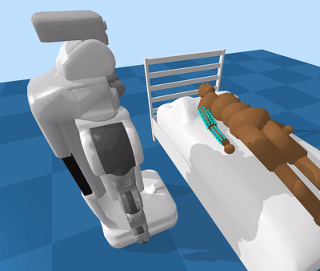

### Support for the Stretch and PANDA robots
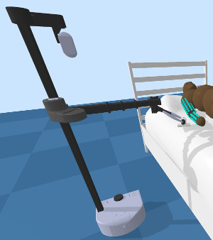
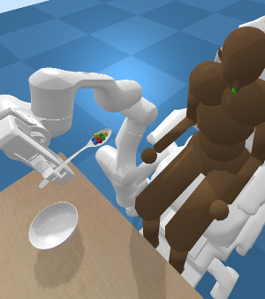

### Multi-robot control support
Assitive Gym now provides an interface for simulating and controlling multiple robots and people, all through the OpenAI Gym framework. See this example of [multi-robot control ](https://colab.research.google.com/drive/1NPWZNFpB9NCgTQpbwM78jVHJAC7q_0oR?usp=sharing).  
&nbsp;  
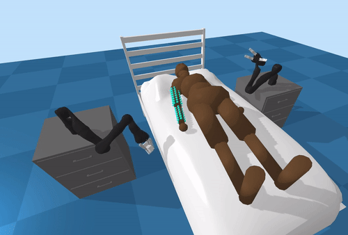

### Integration with iGibson
Assistive Gym can now be used with [iGibson](http://svl.stanford.edu/igibson/) to simulate human-robot interaction in a visually realistic interactive home environment.  
An example of using iGibson with Assistive Gym is available in [this Google Colab notebook ](https://colab.research.google.com/drive/1qFbjuq5lFxPijyw4PFUiZw2sFpXTR7ok?usp=sharing).  
&nbsp;  
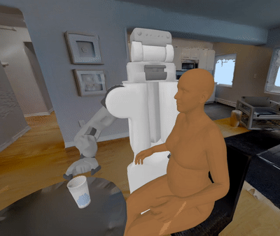

### Static human mesh models (with SMPL-X)
SMPL-X human mesh models are now supported in Assistive Gym. See this [wiki page](https://github.com/Healthcare-Robotics/assistive-gym/wiki/8.-Human-Mesh-Models-with-SMPL-X) for details of how to use these human mesh models.

A Google Colab example of building a simple robot-assisted feeding environment with SMPL-X human meshes is also available: [Assistive Gym with SMPL-X in Colab ](https://colab.research.google.com/drive/1gz2mQmkTf9g1Jvo6_-WgSQ60cgGHmGOt?usp=sharing)  
&nbsp;  
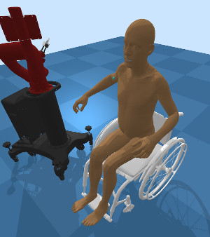
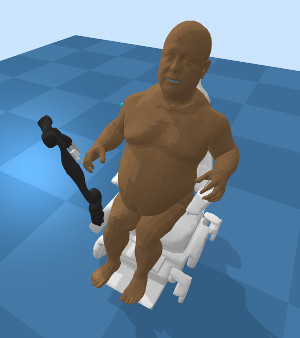

***

## Base Features
### Human and robot models 
Customizable female and male human models (default body sizes and weights matching 50th percentile humans).  
40 actuated human joints (head, torso, arms, waist, and legs)  
&nbsp;  
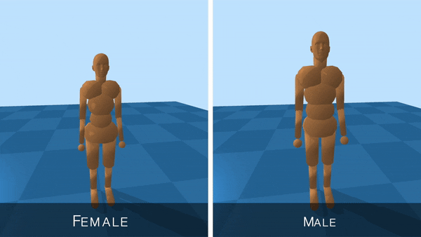  
&nbsp;  
Four collaborative robots (PR2, Jaco, Baxter, Sawyer).  
&nbsp;  
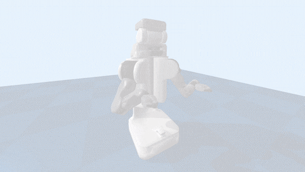
### Realistic human joint limits
Building off of prior research, Assistive Gym provides a model for realistic pose-dependent human joint limits.  
&nbsp;  

### Robot base pose optimization
A robot's base pose can greatly impact the robot’s ability to physically assist people.  
We provide a baseline method using joint-limit-weighted kinematic isotopy (JLWKI) to select good base poses near a person.  
With JLWKI, the robot chooses base poses (position and yaw orientation) with high manipulability near end effector goals.  
&nbsp;  

### Human preferences
During assistance, a person will typically prefer for the robot not to spill water on them, or apply large forces to their body.  
Assistive Gym provides a baseline set of human preferences unified across all tasks, which are incorporated directly into the reward function.
This allows robots to learn to provide assistance that is consist with a person's preferences.  
&nbsp;  


Refer to [the paper](https://arxiv.org/abs/1910.04700) for details on features in Assistive Gym.
